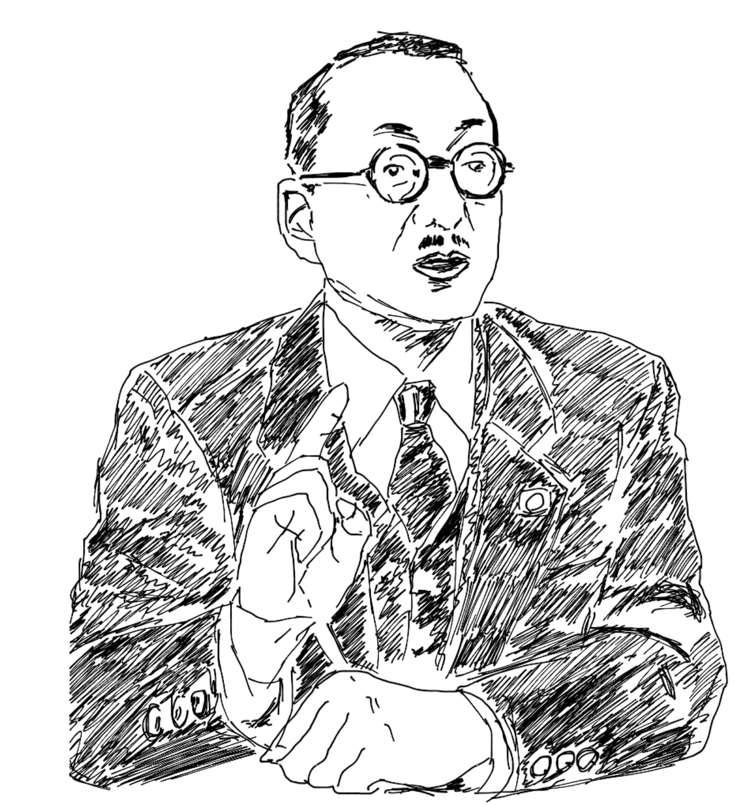

# 魔の研究
## 人間革命に見る魔との闘争

---

## 人間革命とは

---

## 常に自分との戦い

---

## 信心を妨げようとする
## 魔の働きとの闘争

---

## 「仏法は勝負」とは

---

## 「仏法は勝負」
自分自身との戦いに勝つこと

---

### 自分自身との戦いに勝つこと

---

## 戸田城聖先生

+ 「信心は、人間の、また人類の行き詰まりとの戦いだよ。魔と仏との闘争が信心だ。それが仏法は勝負ということだ」

---

## 日蓮大聖人

+ 「夫れ仏法と申すは勝負をさきとし、王法と申すは賞罰を本とせり、故に仏をば世雄と号し王をば自在となづけたり」<small>四条金吾殿御返事〔世雄御書〕・御書：1,165ページ</small>

---

# 賞罰と世雄

---

## 賞罰とは

+ ランクがあり相対的なもの
+ 100点のうち10点とか60点とか、また勲章の等級とは、"より良い"などと比較できる

---

## 世雄とは

+ 人間の世の中にあって最強の勇者ということ

---

## 勝負とは

+ 絶対的なもの
+ 勝つか負けるか
+ 中間はない

---

## 勝負に勝った人を仏という

---

# 仏の別名

---

## 仏の別名

+ 戦勝
+ 勝導師
+ 勝陣
+ 勝他

---

## 仏の別名

+ 健勝破陣
    + 魔軍の陣を破り、勝つ健者、勇者。

---

## 仏の別名

+ 十力降（じゅうりきごう）魔軍
    + 十の力で魔軍を降（くだ）し全滅させる強者

---

## 仏 is

+ 魔との勝負に勝つリーダー
    + 勝導師

---

## 勝ってこそ仏法
## 勝ってこそ信心

---

## 魔軍との戦いの描写

「第六天の魔王・十軍のいくさを・をこして・法華経の行者と生死海の海中にして同居穢土（どうこえど）を・とられじ・うばはんと・あらそう、日蓮其の身にあひあたりて大兵を・をこして二十余年なり、日蓮一度もしりぞく心なし」

---

## 第六天の魔王 vs 日蓮大聖人

---

## 第六天の魔王

+ 十の軍隊をもって戦争を起こし、法華経の行者と"生死の苦しみの海"の中で、同居穢土（どうこえど=娑婆世界のように、六道の凡夫と四聖が同居する国土）を、「取られまい」「奪おう」と争う。

---

## 日蓮大聖人

+ その身にあたって、仏の大軍を起こして二十余年になる。その間一度も、退く心はない。

---

## 一度も、退く心はない。
### これが仏。

---

# 魔の軍勢

---

#### 「十の軍隊をもって戦争を起こし」とあったが
## 「魔の十軍」とはなにか

---

## 煩悩の軍隊のこと

---

## 魔の十軍(1)

+ 欲
    + 五欲にとらわれて、修行を怠るようになる。

---

## 魔の十軍(2)

+ 憂愁（うしゅう）
    + 気がふさぎ、ものうくなってくる。

---

## 魔の十軍(3)

+ 飢渇（けかち）
    + うえとかわきにさいなまれる。

---

## 魔の十軍(4)

+ 渇愛（かつあい）
    + 愛欲、執着によって堕落していく。
    + 異性への愛着や、酒などの快楽におぼれる姿など。

---

## 魔の十軍(5)

+ 睡眠
    + 惰眠を続けるような真剣ではない生活であり、態度のこと。
    + 要領よく生きていく人生も含む。
    + 「まったく眠るな」ではない。

---

## 魔の十軍(6)

+ 怖畏（ふい）
    + おそれに負けて臆病になる。

---

## 魔の十軍(7)

+ 疑悔（ぎげ）
    + 修行者をそそのかして、疑いと悔いを起こさせる。

---

## 魔の十軍(8)

+ 瞋恚（しんに）
    + 怒りの心によって、修行が妨げられる。

---

## 魔の十軍(9)

+ 利養虚称（りようこしょう）
    + 名利と虚名にとらわれて、成仏への道を踏み外す。

---

## 魔の十軍(10)

+ 自高蔑人（じこうべつにん）
    + 自己を高くし、人を見くだす。

---

### 反逆者に共通する傲慢な生命

+ 十の魔軍にみずから敗れ、捕らわれて、向こうの陣についてしまった者たち

---

### 魔軍を打ち破る武器は何か

---

# 信心の利剣

---

## 広布のリーダーの第一要件

+ "信心強き"勇者でなければならない

---

## 広布のリーダーの第一要件

+ どんなに優秀なリーダーに見えたとしても根本的な魔との"生命の戦い"に勝利することはできない。
+ 「信心」が強いかどうか。

---

## 「信心」が強いかどうか。

---

# 宇宙全体の姿

---

### -宇宙全体の姿-
「生死の海」を舞台に仏と魔との壮絶な戦いが繰り広げられている勝負の世界

---

### -宇宙全体の姿-
## 調和と混沌の乱気流

---

### -宇宙全体の姿-
## "結びつける"慈愛の力と
## "切り離す"憎悪の力

---

### -宇宙全体の姿-
## 生と死

---

### -宇宙全体の姿-
## 光と闇

---

### -宇宙全体の姿-
## 幸福と不幸

---

### -宇宙全体の姿-
## 前進と後退

---

### -宇宙全体の姿-
## 上昇と下降

---

### -宇宙全体の姿-
## 開放と閉鎖

---

### -宇宙全体の姿-
## 希望と絶望

---

### -宇宙全体の姿-
## "生かす"エネルギーと
## "殺す"衝動

---

# 結論

---

## 仏法者の使命として

絶対に私どもは、永遠に幸福になりゆく法則（南無妙法蓮華経）に従い、崩れざる常楽の世界をつくっていきたい！

---

おしまい🍣 🍺
